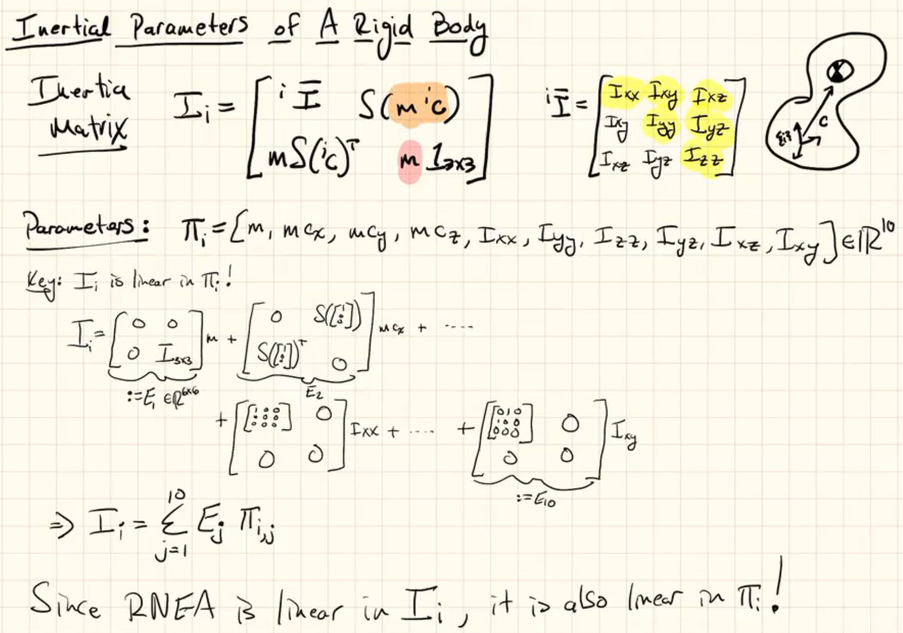
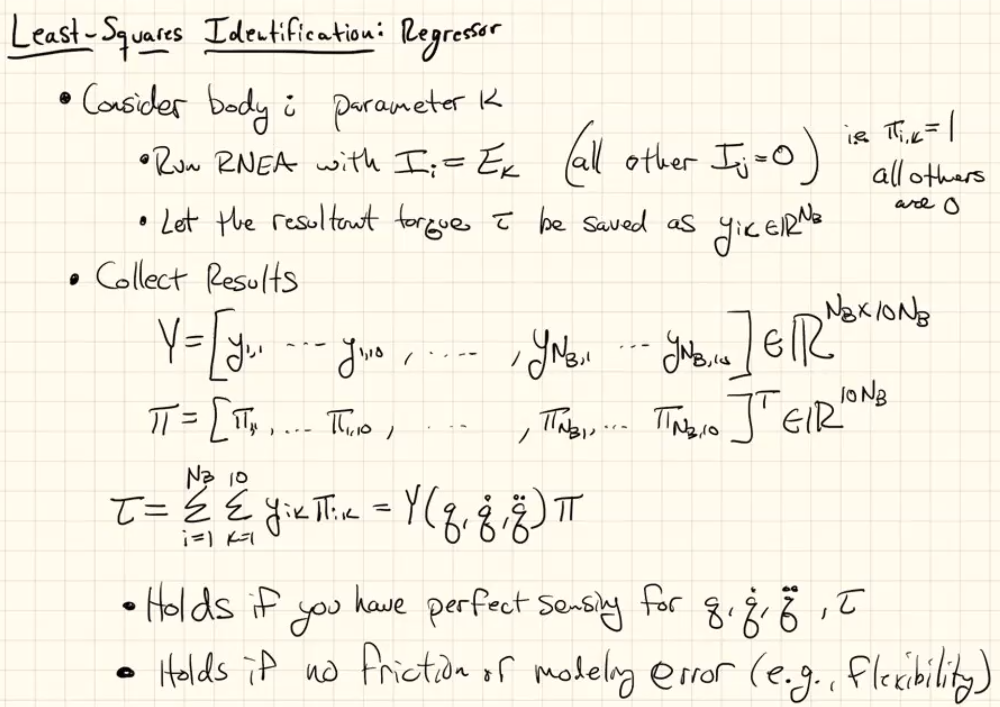
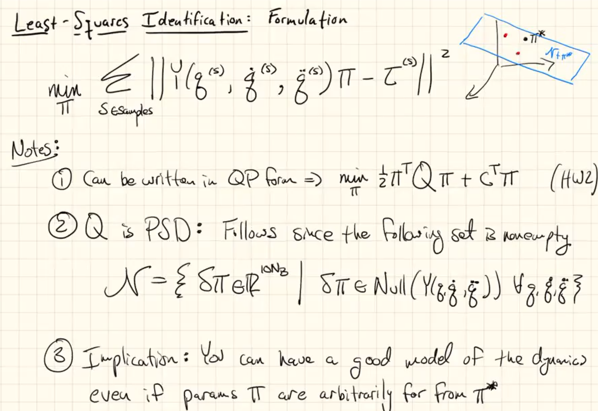

Identification
==============

Kinematic Models of Robots
--------------------------

* Useful for :math:`^{i}X_{p(i)},\ ^{i}\phi_i`
* Link lengths, structural angles for joint axes, etc.
* Often accurate based on CAD
* Else kinematic calibration may be required

Dynamic models of Robots
------------------------

* Combines kinematic and inertia model
* CAD not as useful. Extra parts/wires/etc are challenging
* Instead data-driven approach

.. note::
  Since inertia is linear in :ref:`dynamics/multibody:Structure of EoM`, we can
  solve for inertia easily. We will have many data points, the first choice that 
  comes to mind is least squares.

:ref:`dynamics/primer_spatial:Spatial Inertia` is determined by 10 parameters:

* 1 from m
* 3 from c
* 6 from :math:`\overline{I}`

.. attention::
  One trick is required to maintain linearity of Inertia matrix. (In below image,
  the trick is applied on the upper right element of the inertia matrix; but not
  on the lower left element. Normally we modify both elements to make both linear.)

  We turned :math:`mS(\ ^{i}c)` to :math:`S(m\ ^{i}c)`. Now all 10 parameters defining 
  spatial inertia is linearly related.

Least-Squares Identification
----------------------------

.. attention::
  Q is PSD (Positive semi-definite). As a result it implies that the obtained inertia 
  values for the same bodies might not agree. However, the resulting dynamics must
  and does agree. So, the resulting body inertias of a system are not unique, but as a set
  they are consistent with the dynamics. (They give/require same torques for same
  motions, at the end; for the controller it does not matter.)
  
  In this sense, sine the mass values are somewhat arbitrary we can observe 
  even negative values. However, that implies overfitting. (?) -> evade negative (?)