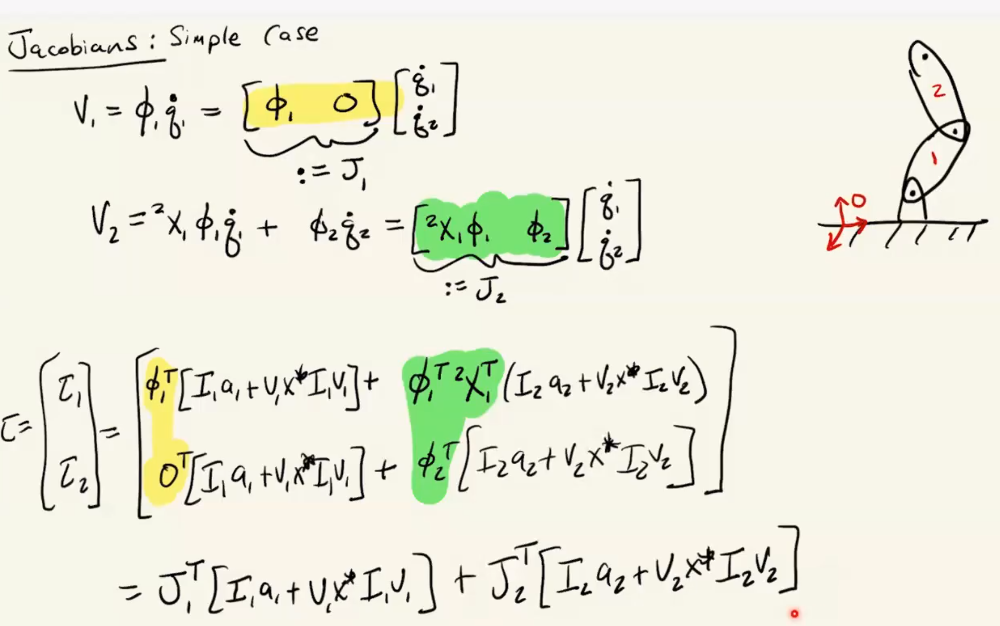
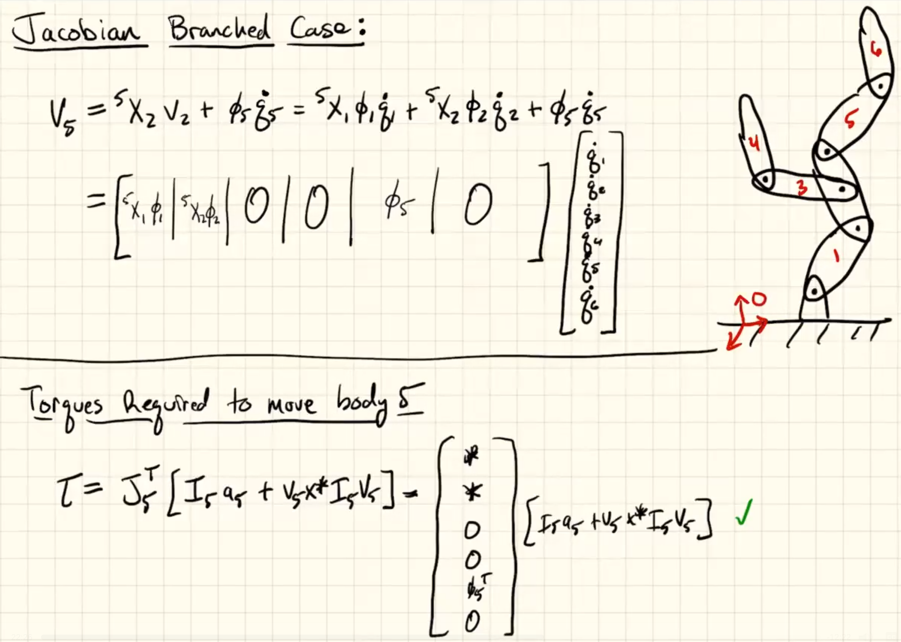
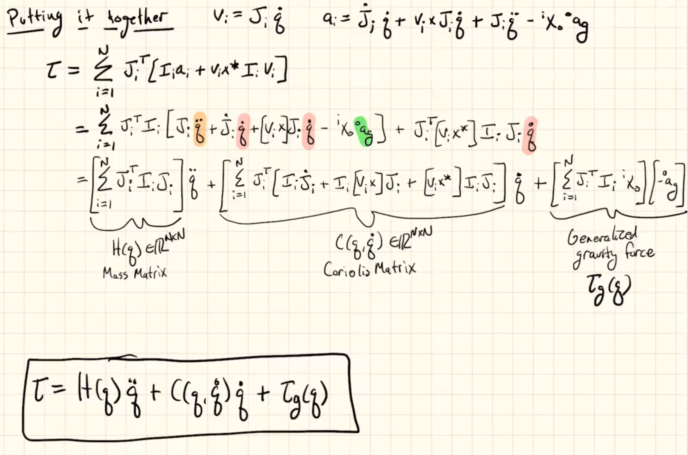

Multibody
=========

Multibody Systems
-----------------

Use generalized coordinates **q**.

Multibody systems of interest can be represented as trees.

#. Number bodies from 1 to N
    parent link should be numbered before any of its children, **c(i)**.

#. Joint i connect body i to its parent, **p(i)**
     Though generalizable, it works well with revolute and prismatic 
     while being pretty simple

#. Frame {i} attached to body i, immediately after joint i. 

Define :math:`\phi_i` as the spatial velocity of a joint which uses its own
generalized coordinate as unit.

Velocity Propagation
^^^^^^^^^^^^^^^^^^^^

.. math::
  v_i = v_{p(i)} + \phi_i \dot{q}_i

Acceleration Propagation
^^^^^^^^^^^^^^^^^^^^^^^^

.. math::
  ^{i}a_i =\ ^{i}X_{p(i)}\ ^{p(i)}a_{p(i)} +\ ^{i}\phi_i \ddot{q}_i 
  +\ ^{i}v_i \times\ ^{i}\phi_i \dot{q}_i

Force Propagation
^^^^^^^^^^^^^^^^^

.. math::
  f_i - \sum_{j \in c(i)}{f_{j}} = I_i a_i + v_i \times^{*} I_i v_i

In addition:

.. math::
  \tau_i = \phi^{T}_i f_i

Recursive Newton Euler
----------------------

The algorithm is denoted: :math:`\tau = RNEA(q, \dot{q}, \ddot{q})`
or :math:`\tau = ID(model, q, \dot{q}, \ddot{q})`.
It has linear complexity with respect to number of bodies.

.. note:: 
  From now on, if coordinate of a quantity is not shown, but we are working with coordinates.
  That means, the quantity is defined in its own coordinates.

  e.g., :math:`v_i` implies :math:`^{i}v_i`

Make two passes:

1. From root to nodes
   
  Propagate velocity -> acceleration -> force

  Root velocity is initialized at 0. (Fixed-base)

2. From nodes to root
   
  Propagate force to parents

3. After both passes, obtained forces are valid.

Gravity
^^^^^^^

Initialize root acceleration as :math:`-\ ^{o}a_g`. By doing so gravity is 
taken into account.

Jacobian
--------

Spatial variant of jacobian.

Simple Jacobian
^^^^^^^^^^^^^^^

Branched Jacobian
^^^^^^^^^^^^^^^^^

Structure of EoM
----------------

.. note::
  
  All terms linear in inertias.

EoM Properties
^^^^^^^^^^^^^^^

1. :math:`H(q) \in R^{N \times} \succ 0`
2. :math:`\dot{H} - 2C` is skew-symmetric; :math:`[\dot{H} -2C]^{T} = -[\dot{H} - 2C]`
3. Many other definitions of C are also valid; as long as :math:`C(q, \dot{q})\dot{q}` 
   does not change. But it satisfies the skew-symmetric condition from above.

.. note::
  * Coriolis terms appear as product of two distinct velocities
  * Centripetal terms appears as the square of a velocity

4. C matrix based on Christoffel Symbols of the first kind also satisfies 
   skew-symmetric condition from above.
5. All valid definitions of C satisfy:
  
  .. math::
    \dot{q}^{T}[\dot{H} (q, \dot{q}) - 2C (q, \dot{q})] \dot{q} = 0

6. "Special" definitions of C's satisfying property 2 (skew-symmetric) have following
   in contrast to above one:

  .. math::
    \dot{\alpha}^{T}[\dot{H} (q, \dot{q}) - 2C (q, \dot{q})] \dot{\alpha} = 0

    \forall \alpha \in R^{n}
  
