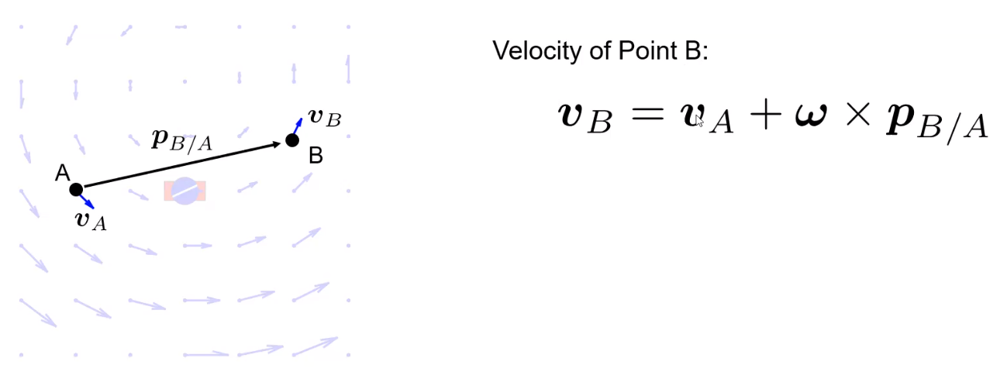
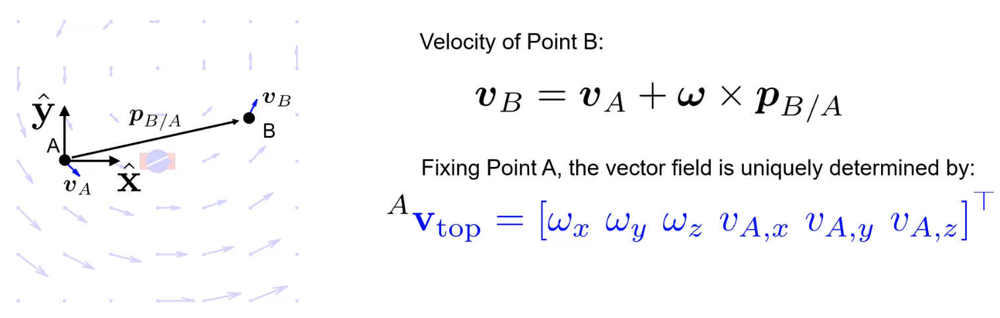
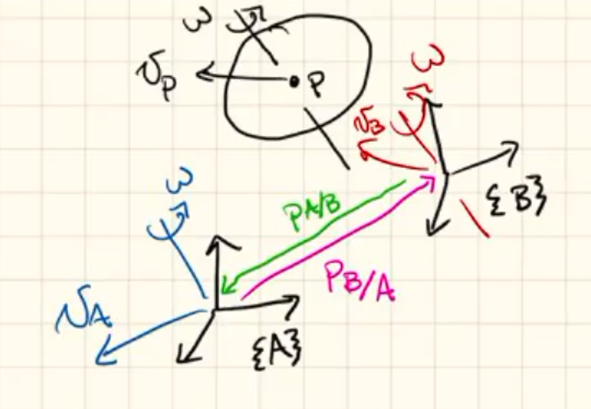
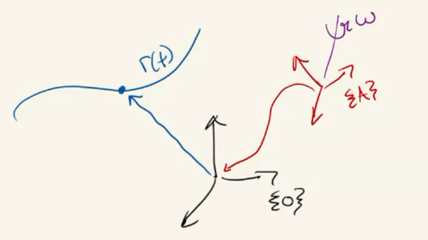
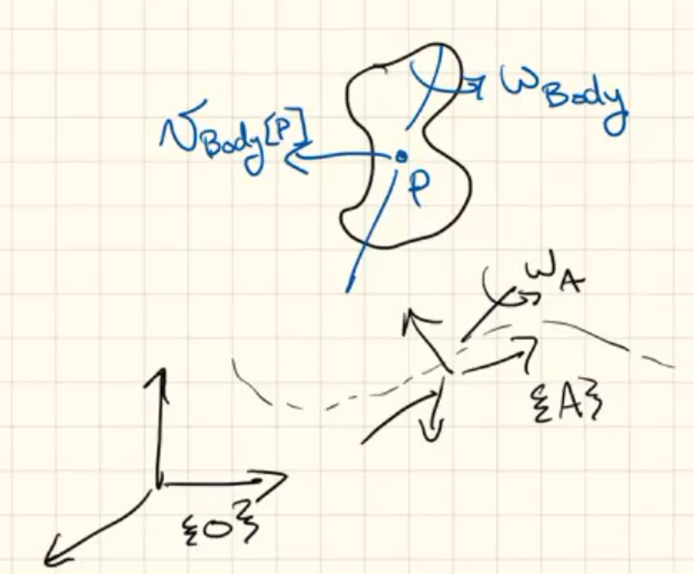
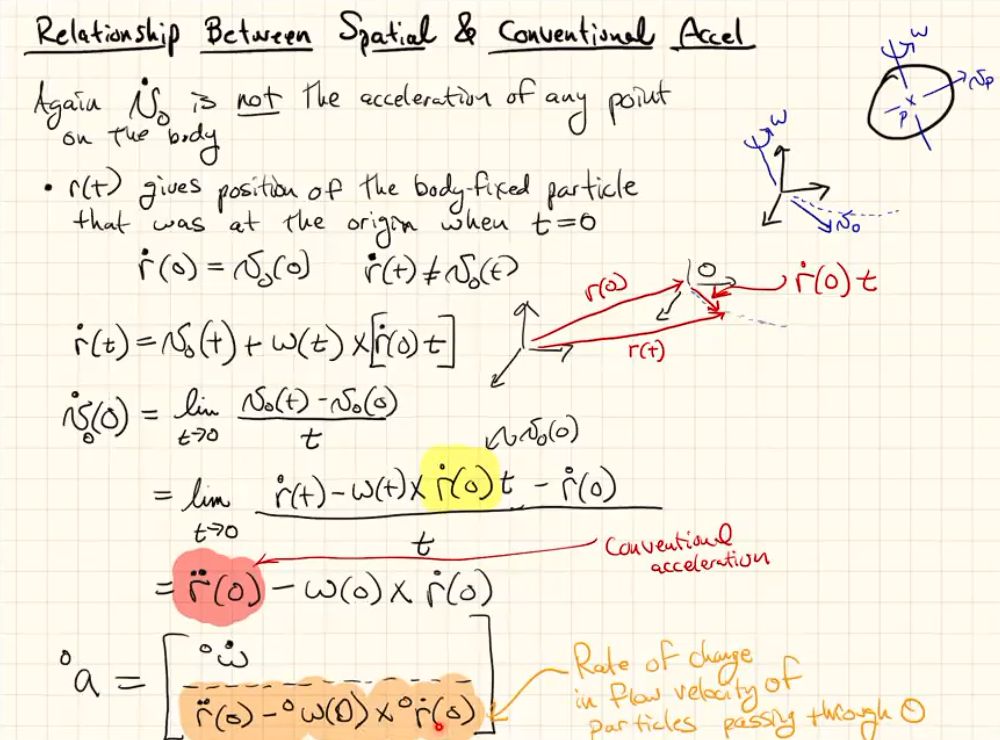
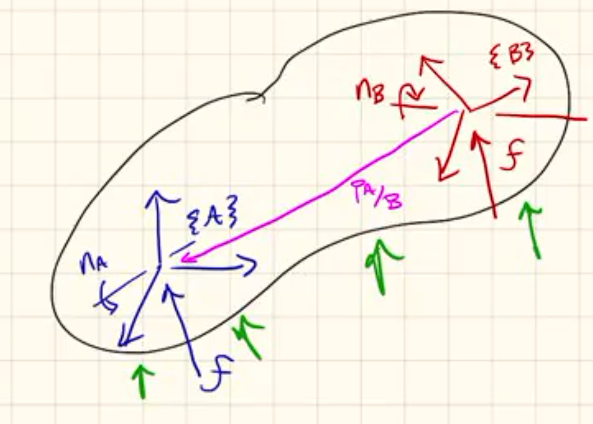
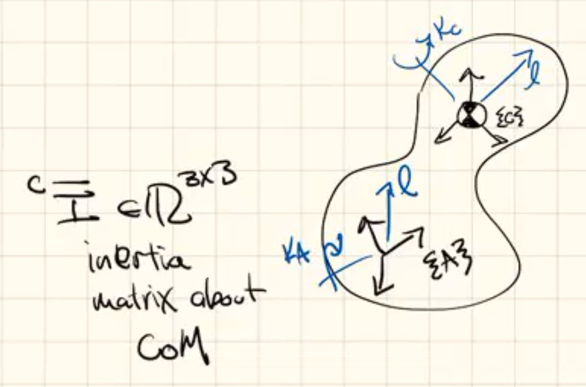
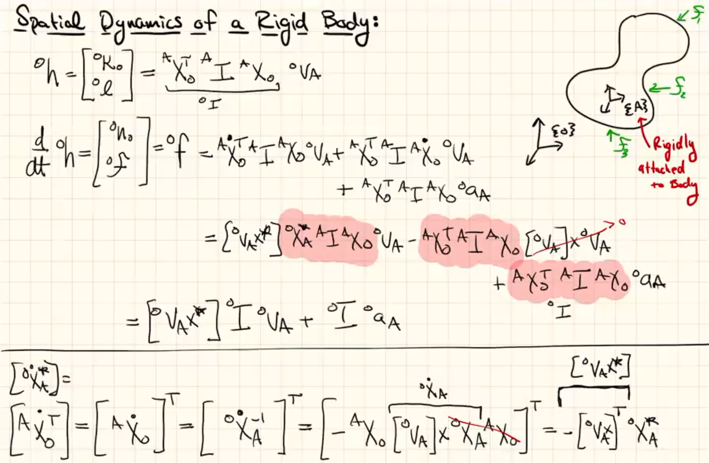

Single Body
===========

.. note::
  This page is rather detailed, it tries to follow the lectures of Prof. Patrick Wensing closely.
  It does not look like the best approach: takes a long time to produce and 
  gets crowded. I want this notes to be brief and to the point.
  
  Next chapters are more refined. Instead of using this page following is strongly
  recommended :ref:`dynamics/primer_spatial:Primer on Spatial Dynamics`.

Spatial Velocity
----------------

Spatial velocity is defined as a :ref:`dynamics/Fundamentals:vector field`. It is different then the conventional
sense of velocity. Conventional velocity is defined as a single vector.

A good way to think of the spatial velocity is to think that the body extends to
infinity in all directions. All points on body will have a certain velocity in the
conventional sense. All these conventional velocity vectors create a vector field
which we define as the spatial velocity.

Let's continue with an example.

Spinning Top
^^^^^^^^^^^^

We will use an example: spinning top on a cart to explain following sections.

.. list-table:: 

  * - 
      .. figure:: ../images/spinning_top.png

        Sketch (3-D side view)

    - .. figure:: ../images/spinning_top_vf.png
  
        Corresponding vector field for velocity (top view)

        Note the vector field will change over time.

Relationship between conventional velocities
^^^^^^^^^^^^^^^^^^^^^^^^^^^^^^^^^^^^^^^^^^^^

Selecting 2 points A and B from the vector field of spinning top.
Their velocities are related as following:

Spatial Velocity in Coordinates
^^^^^^^^^^^^^^^^^^^^^^^^^^^^^^^

As shown above, to get velocity of point B we only need
:math:`v_A(t), \omega(t)`. We can define B as any point in the 
vector space, then compute its velocity. That means :math:`v_A(t), \omega(t)` is sufficient to  
uniquely define the vector field.

For rigid body motion assigning a coordinate frame to point A.

.. attention::
  :name: 6-dim velocity

  The set of vectors describing rigid body velocities is a 6-dim vector space.

As we write the spatial velocity as a 6-dim vector, we concatenate the linear and
angular components. Their order verify from author to author, we use angular
components first.

.. topic:: Example 1 
  :name: Example 1

  .. figure:: ../images/spinning_top_v.png

The coordinate system such as the one in the above example is used to construct 
a basis which defines all possible rigid body motion. This basis is called as the 
:ref:`dynamics/Fundamentals:Plücker Coordinates`. Then using them, we can express 
the velocity in the example as following:

.. math::
  V_{top} = w_x e_1 + w_y e_2 + w_z e_3 + v_x e_4 + v_y e_5 + v_z e_6
  
  where\ V_{top} \in M \subseteq \Phi^3

Transforming Spatial Velocity
-----------------------------

.. note::
  Check out :ref:`dynamics/Fundamentals:Variable-Frame Notation`

Consider a moving rigid body; two coordinate frames, A and B can be used to 
express its velocity. To transform between them:

.. math:: 
  ^{A}V =\ \begin{bmatrix} ^{A}w \\ ^{A}v_A \end{bmatrix}
  \ ^{B}V =\ \begin{bmatrix} ^{B}w \\ ^{B}v_B \end{bmatrix}

.. math::
  v_B &=\ v_A\ +\ w \times p_{B/A}

  &= v_A\ +\ p_{A/B} \times w

.. math::
  ^{B}v &=\ 
  \begin{bmatrix}
    ^{B}w \\
    \rule[.5ex]{1.5em}{0.4pt} \\
    ^{B}v_B 
  \end{bmatrix}

  &=\ 
  \begin{bmatrix} 
    ^{B}R_A & \rule[-1ex]{0.5pt}{2.5ex} & 0 \\ 
    \rule[.5ex]{5em}{0.4pt} & & \rule[.5ex]{2em}{0.4pt} \\
    ^{B}P_{A/B} \times\ ^{B}R_A & \rule[-1ex]{0.5pt}{2.5ex} & ^{B}R_A 
  \end{bmatrix}
  \begin{bmatrix}
    ^{A}w \\
    \rule[.5ex]{1.5em}{0.4pt} \\
    ^{A}v_A 
  \end{bmatrix}

  &=\ 
  \begin{bmatrix} 
    ^{B}R_A & \rule[-1ex]{0.5pt}{2.5ex} & 0 \\ 
    \rule[.5ex]{5em}{0.4pt} & & \rule[.5ex]{2em}{0.4pt} \\
    S(\ ^{B}P_{A/B}) ^{B}R_A & \rule[-1ex]{0.5pt}{2.5ex} & ^{B}R_A 
  \end{bmatrix}
  \begin{bmatrix}
    ^{A}w \\
    \rule[.5ex]{1.5em}{0.4pt} \\
    ^{A}v_A 
  \end{bmatrix}

  &=\ 
  ^{B}X_A
  \begin{bmatrix}
    ^{A}w \\
    \rule[.5ex]{1.5em}{0.4pt} \\
    ^{A}v_A 
  \end{bmatrix}
  =\ ^{B}X_A\ ^{A}v

We obtained :math:`^{B}X_A` which allows a change of basis from Plucker coords 
with respect to frame A to frame B. Meanwhile we also defined :math:`S()` to 
replace cross-product, for clarity. (:ref:`dynamics/Fundamentals:Cross product`)

Moving Frames
-------------

.. math::
  ^{A}r(t) =\ \begin{bmatrix} r_x \\ r_y \\ r_z \end{bmatrix}

.. math::
  ^{O}r &=\ ^{O}R_A\ ^{A}r

  ^{O}\dot{r} &=\ ^{O}\dot{R}_A\ ^{A}r\ +\ ^{O}R_A\dv{^{A}r}{t}

  &=\ S(^{O}w_A)\ ^{O}{R}_A\ ^{A}r\ +\ ^{O}R_A\dv{^{A}r}{t}

  &=\ ^{O}w_A \times\ ^{O}r\ +\ ^{O}R_A\dv{^{A}r}{t}

  ^{A}\dot{r} &=\ ^{A}w_A \times\ ^{A}r\ + \dv{^{A}r}{t}

where the first term stands for coordinate axes moving; and the second term
for the change in coordinates.

.. note:: 
  :math:`w \times r` is meaningful without coordinates. We say this operation is
  coordinate invariant.

  Considering the drawing above, we could compute :math:`^{O}w \times ^{O}r` as
  following:

  .. math:: 
    &=\ ^{O}R_A(\ ^{A}w \times ^{A}r)

    &=\ (^{O}R_A\ ^{A}w) \times (^{O}R_A\ ^{A}r)

  So, it does not matter much where the computation is performed. It is easy to
  change/assign a coordinate frame.

Spatial Acceleration
--------------------

Just like spatial velocity, spatial acceleration is a vector field and it is 
equal to 

.. math::
  a_{top} = \dv{V_{top}}{t}

Similar to spatial velocity, spatial acceleration is defined
by a :ref:`6-dim vector space <6-dim velocity>`.

Consider `Example 1`_, its spatial acceleration is 0 everywhere. Considering 
frame O is inertially fixed:

.. math:: 
  ^{O}a_{top} = \begin{bmatrix} ^{O}\dot{w}_{top}\ \\ ^{O}[a_{top}(0)] \end{bmatrix}

in which 

* First three components give angular acceleration.
* Last three give rate of change in flow of body-fixed particles through {O}.

.. topic:: Example 2
  :name: Example 2

  .. figure:: ../images/top_on_skateboard_acc.png

Spatial Cross Product - Velocity
--------------------------------

.. math:: 
  ^{O}v_{body} = \begin{bmatrix} ^{O}w_{body} \\ ^{O}v_{body[O]} \end{bmatrix}\
  ^{O}v_A = \begin{bmatrix} ^{O}w_A \\ ^{O}v_{A[O]} \end{bmatrix}

.. math::
  ^{O}a_{body} &= \dv{[\ ^{O}v_{body}]}{t} 
  
  &= \dv{[\ ^{O}X_A\ ^{A}v_{body}]}{t}

  &=\ ^{O}\dot{X}_A\ ^{A}v_{body} + ^{O}X_A\ \dv{\ ^{A}v_{body}}{t}

  &=\ 
  \begin{bmatrix} 
    S(\ ^{O}w_A) & 0 \\ 
    S(\ ^{O}v_{A[O]}) & S(\ ^{O}w_A)
  \end{bmatrix}
  \ ^{O}X_A\ ^{A}v_{body} + ^{O}X_A\ \dv{\ ^{A}v_{body}}{t} 

  &=\ 
  \bold{[^{O}v_A \times]}
  \ ^{O}X_A\ ^{A}v_{body} + ^{O}X_A\ \dv{\ ^{A}v_{body}}{t} 

Here we introduced :math:`\bold{[^{O}v_A \times]}` as the spatial cross product.

* In frame O:
  
  .. math::
    ^{O}a_{body}\ =\ 
    ^{O}v_A \times
    \ ^{O}v_{body} + ^{O}X_A\ \dv{\ ^{A}v_{body}}{t} 

* In frame A:

  .. math:: 
    ^{A}a_{body}\ =\ 
    ^{A}v_A \times
    \ ^{A}v_{body} + \dv{\ ^{A}v_{body}}{t} 

.. attention::
  As seen in two samples above: spatial cross product is coordinate invariant.

.. note::
  Note the structural similarity with the `Moving Frames`_.

  The first term accounts for the moving coordinate; second term for the 
  changing coordinates

.. topic:: Example 3
  :name: Example 3

  .. figure:: ../images/top_on_skateboard_acc_moving.png

Relationship Between Spatial & Conventional Acceleration
--------------------------------------------------------

.. todo::
  Clear it up, find better equations(?)

:math:`\dot{v}_o`: time rate of change of velocity of body-fixed particles at point O.

Spatial Forces
--------------

It is a 6-dim vector which combines a force through a point and a moment through
the same point.

.. math::
  ^{B}F &= \begin{bmatrix} ^{B}n_B \\ ^{B}f \end{bmatrix}

  ^{A}F &= \begin{bmatrix} ^{A}n_A \\ ^{A}f \end{bmatrix}

  &= \begin{bmatrix} ^{A}R_B\ ^{B}n_B & -^{A}R_B\ ^{B}P_{A/B} \times\ ^{B}f  \\ ^{A}R_B\ ^{B}f\end{bmatrix}

  &= \begin{bmatrix} ^{A}R_B\ -\ ^{A}R_B\ S(^{B}P_{A/B}) \\ 0 & ^{A}R_B \end{bmatrix}
  \begin{bmatrix} ^{B}n_B \\ ^{B}f \end{bmatrix}

  &=\ \bold{^{A}X^{*}_B}\ ^{B}f

which defines the transform for the spatial forces.

.. attention::
  Relationship between spatial force transforms and `Transforming Spatial Velocity`_:

    :math:`^{B}X^{T}_A =\ ^{A}X^{*}_B`

Spatial Momentum
----------------

In a similar fashion to other spatial quantities we combine angular and linear
momentum to get a 6-dim vector. {c} denotes center of mass (CoM), whereas {A}
is the origin of some arbitrary frame.

.. math::
  ^{c}h &= \begin{bmatrix} ^{c}K_c \\ \rule[.5ex]{2em}{0.4pt} \\ ^{c}l \end{bmatrix}

  &= \begin{bmatrix} ^{c}\overline{I}\ ^{c}w \\ m\ ^{c}v_c \end{bmatrix}

  &= \begin{bmatrix} ^{c}\overline{I}\ & 0 \\ 0 & m 1_{3x3} \end{bmatrix}
  \begin{bmatrix} ^{c}w \\ ^{c}v_c \end{bmatrix}

.. math:: 
  ^{A}h &= \begin{bmatrix} ^{A}K_A \\ ^{A}l \end{bmatrix}

  &= \begin{bmatrix} ^{A}R_c\ ^{c}K_c -\ ^{A}R_c [^{c}P_{A/C} \times]\ ^{c}l \\ ^{A}R_c\ ^{c}l \end{bmatrix}

  &=\ ^{A}X^{*}_c\ ^{c}h

  &=\ ^{A}X^{*}_c\ ^{c}I\ ^{c}v

  &=\ ^{A}X^{*}_c\ ^{c}I\ ^{c}X_A\ ^{A}v

  &=\ ^{A}I\ ^{A}v

Spatial Dynamics
----------------

.. math::
  ^{o}h &= \begin{bmatrix} ^{o}K_o \\ ^{o}l \end{bmatrix} =\ ^{o}X^{*}_A\ ^{A}I\ ^{A}X_o\ ^{o}v_A

  &=\ ^{o}I\ ^{o}v_A

  \dv{\ ^{o}h}{t} &= \begin{bmatrix} ^{o}n_o \\ ^{o}f \end{bmatrix} =\ ^{o}F

  &= ...

  &=\ ^{o}I\ ^{o}a_A + \bold{[^{o}V_A \times^{*}]}\ ^{o}I\ ^{o}v_A 

We introduced a new spatial cross product above; this one can be used for forces 
and momenta.

.. attention::
  Resulting equation is valid for any frame: moving, non-center of mass, etc.
